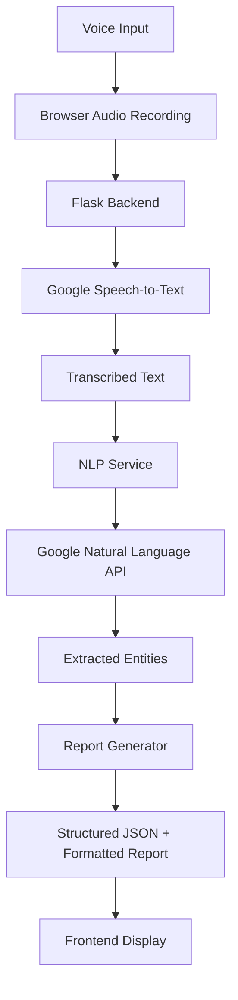

# Pediatric Oncology Speech-to-Report Generator

A Flask-based web application that converts spoken clinical notes into structured discharge summaries for pediatric oncology patients. The application leverages Google Cloud's Speech-to-Text and Natural Language APIs to transcribe audio and extract medical entities.

## 🎯 Project Objective

Convert voice input from clinicians into:
- Real-time transcribed text
- Structured JSON data with medical entities
- Formatted discharge summary reports

## 🏗️ Architecture

The application follows a two-part architecture:

### Frontend (Web Application)
- Single-page application with voice recording interface
- Real-time transcription display
- Report preview and export functionality

### Backend (Flask API Server)  
- RESTful API endpoints for audio processing
- Integration with Google Cloud services
- Medical entity extraction and report generation

## 📁 Project Structure

```
emr/
├── app.py                          # Main Flask application
├── work.md                         # Project specification document
├── README.md                       # This file
├── requirements.txt                # Python dependencies
├── .env.example                    # Environment variables template
├── .gitignore                      # Git ignore patterns
│
├── config/
│   ├── __init__.py
│   └── config.py                   # Application configuration
│
├── services/
│   ├── __init__.py
│   ├── transcription_service.py    # Google Cloud Speech-to-Text integration
│   ├── nlp_service.py             # Natural Language Processing & entity extraction  
│   └── report_generator.py        # Report generation and formatting
│
├── templates/
│   └── index.html                  # Main web interface
│
├── static/
│   ├── css/
│   │   └── style.css              # Application styling
│   └── js/
│       └── app.js                 # Frontend JavaScript logic
│
└── utils/
    ├── __init__.py
    └── json_schema.py             # JSON schema definitions and templates
```

## 🚀 Getting Started

### Prerequisites
- Python 3.8+
- Google Cloud Platform account
- Google Cloud Speech-to-Text API enabled
- Google Cloud Natural Language API enabled

### Installation

1. **Clone and navigate to project:**
   ```bash
   cd /home/nithin/work/emr
   ```

2. **Create virtual environment:**
   ```bash
   python -m venv venv
   source venv/bin/activate  # On Windows: venv\Scripts\activate
   ```

3. **Install dependencies:**
   ```bash
   pip install -r requirements.txt
   ```

4. **Set up Google Cloud credentials:**
   - Create a service account in Google Cloud Console
   - Download the JSON key file
   - Set up environment variables (see Configuration section)

5. **Configure environment variables:**
   ```bash
   cp .env.example .env
   # Edit .env with your configuration
   ```

6. **Run the application:**
   ```bash
   python app.py
   ```

7. **Access the application:**
   - Open browser to `http://localhost:5000`

## ⚙️ Configuration

### Environment Variables (.env)

```bash
# Google Cloud Configuration
GOOGLE_APPLICATION_CREDENTIALS=path/to/your/service-account-key.json
GOOGLE_CLOUD_PROJECT=your-project-id

# Flask Configuration  
FLASK_ENV=development
FLASK_DEBUG=True
SECRET_KEY=your-secret-key-here

# Server Configuration
HOST=0.0.0.0
PORT=5000
```

### Google Cloud Setup

1. **Enable APIs:**
   - Cloud Speech-to-Text API
   - Cloud Natural Language API
   - Cloud Healthcare API (optional)

2. **Service Account Permissions:**
   - Speech to Text Admin
   - Natural Language Admin
   - Healthcare Dataset Admin (if using Healthcare API)

## 🔧 API Endpoints

### `POST /api/transcribe`
Transcribe audio to text
- **Input:** Audio file (multipart/form-data)
- **Output:** `{"transcription": "transcribed text"}`

### `POST /api/generate-report`
Generate structured report from transcription
- **Input:** `{"transcription": "medical text"}`
- **Output:** `{"structured_data": {...}, "report": {...}}`

### `GET /api/health`
Health check endpoint
- **Output:** `{"status": "healthy"}`

## 🏥 Medical Entity Recognition

The application automatically extracts:

- **Patient Demographics:** Age, sex, name, MRN
- **Diagnoses:** Oncology conditions, medical diagnoses
- **Clinical Findings:** Vital signs, physical examination findings
- **Lab Results:** Blood counts, test results
- **Medications:** Drug names, dosages, treatments
- **Medical Professionals:** Doctor names, healthcare providers

## 📊 Data Flow



## 📊 Logging & Error Tracking

The application includes comprehensive logging for debugging and monitoring:

### **Log Files Location:**
```
logs/
├── app.log         # General application logs
├── error.log       # Error logs only  
└── gcp_api.log     # Google Cloud API calls
```

### **Log Levels:**
- **INFO:** General application flow
- **WARNING:** Non-critical issues  
- **ERROR:** Errors with full stack traces
- **DEBUG:** Detailed debugging information

### **View Logs:**
```bash
# View all logs
python view_logs.py

# View specific log type
python view_logs.py error
python view_logs.py app
python view_logs.py gcp

# View last 100 lines
python view_logs.py all 100
```

### **Log Features:**
- **Automatic rotation** when files reach 10MB
- **Frontend error logging** sent to backend
- **Detailed error context** with stack traces
- **Google Cloud API debugging** with request/response details
- **Request/response logging** for all API calls

## 🧪 Testing

Run the application and test with sample medical dictation:

**Example Input:**
> "Patient is a 7-year-old female with B-ALL high risk induction. Temperature 100.3 Fahrenheit. Hemoglobin 9, white blood cell count 1000, platelet count 147000. Started on Cefoperazone sulbactam and Oseltamivir. Attending physician Dr. Prasanth V.R."

**Expected Output:**
- Real-time transcription display
- Structured JSON with extracted entities
- Formatted discharge summary

## 🔒 Security Considerations

- Store Google Cloud credentials securely
- Use HTTPS in production
- Implement user authentication for production use
- Sanitize all audio and text inputs
- Follow HIPAA compliance guidelines for medical data

## 🚀 Deployment

### Production Deployment

1. **Set production environment:**
   ```bash
   export FLASK_ENV=production
   ```

2. **Use production WSGI server:**
   ```bash
   gunicorn -w 4 -b 0.0.0.0:5000 app:app
   ```

3. **Configure reverse proxy (nginx/Apache)**

## 🔮 Future Enhancements

- EMR system integration
- Real-time streaming transcription
- Multi-language support
- Voice command recognition
- Report template customization
- PDF export functionality
- User authentication and roles
- Audit logging and compliance features

## 📝 License

This project is intended for educational and research purposes in pediatric oncology care.

## 🤝 Contributing

1. Fork the repository
2. Create feature branch
3. Make changes following medical data privacy guidelines
4. Test thoroughly with sample medical data
5. Submit pull request

## 📞 Support

For technical support or questions about medical terminology integration, please refer to the project documentation or create an issue in the repository.

---

**⚠️ Important:** This application handles sensitive medical information. Ensure compliance with healthcare data privacy regulations (HIPAA, GDPR) when deploying in clinical environments.