# Cancer Research Institute AI-Enabled Healthcare System

This Mermaid diagram showcases how PACS (Picture Archiving and Communication System), EMR (Electronic Medical Records), and AI-powered multimodality embedding models work together in a cancer research institute setting.

```mermaid
flowchart TD
    %% Data Sources
    subgraph "Data Acquisition"
        PACS[("🏥 PACS<br/>Picture Archiving &<br/>Communication System")]
        EMR[("📋 EMR/OpenMRS<br/>Electronic Medical Records")]
        LAB[("🧪 Laboratory<br/>Results & Pathology")]
        GEN[("🧬 Genomic<br/>Data")]
    end
    
    %% Data Processing Layer
    subgraph "Data Integration & Processing"
        ETL[("🔄 ETL Pipeline<br/>Data Extraction,<br/>Transformation & Loading")]
        DICOM[("📸 DICOM Processing<br/>Medical Image<br/>Standardization")]
        FHIR[("🔗 FHIR Integration<br/>Healthcare Data<br/>Interoperability")]
    end
    
    %% AI/ML Layer
    subgraph "AI & Machine Learning"
        EMBED[("🤖 Multimodality<br/>Embedding Models")]
        subgraph "AI Models"
            IMG_AI[("👁️ Image Analysis AI<br/>CT, MRI, PET Scans")]
            TEXT_AI[("📝 Clinical NLP<br/>Text Analysis")]
            GENOMIC_AI[("🧬 Genomic AI<br/>Mutation Analysis")]
            PRED_AI[("🎯 Predictive Models<br/>Risk Assessment")]
        end
        FUSION[("🔀 Data Fusion<br/>Multimodal Integration")]
    end
    
    %% Knowledge Base
    subgraph "Knowledge & Research"
        KB[("📚 Knowledge Base<br/>Research Literature<br/>& Clinical Guidelines")]
        BIOBANK[("🏛️ Biobank<br/>Tissue & Sample<br/>Repository")]
        TRIALS[("⚗️ Clinical Trials<br/>Database")]
    end
    
    %% Clinical Decision Support
    subgraph "Clinical Decision Support"
        CDS[("💡 Clinical Decision<br/>Support System")]
        ALERTS[("⚠️ AI-Powered Alerts<br/>Risk Notifications")]
        RECS[("📊 Treatment<br/>Recommendations")]
    end
    
    %% Research & Analytics
    subgraph "Research & Analytics"
        COHORT[("👥 Cohort Analysis<br/>Population Studies")]
        DISCOVERY[("🔬 Drug Discovery<br/>Research Support")]
        OUTCOMES[("📈 Outcomes Research<br/>Treatment Effectiveness")]
        REPORTS[("📄 Research Reports<br/>& Publications")]
    end
    
    %% Clinical Workflow
    subgraph "Clinical Workflow"
        PHYSICIAN[("👩‍⚕️ Oncologists<br/>& Clinicians")]
        RADIOLOGIST[("👨‍⚕️ Radiologists")]
        RESEARCHER[("👩‍🔬 Cancer<br/>Researchers")]
        PATIENT[("🧑‍🤝‍🧑 Patients")]
    end
    
    %% Data Flow Connections
    PACS --> DICOM
    EMR --> ETL
    LAB --> ETL
    GEN --> ETL
    
    DICOM --> EMBED
    ETL --> FHIR
    FHIR --> EMBED
    
    EMBED --> IMG_AI
    EMBED --> TEXT_AI
    EMBED --> GENOMIC_AI
    EMBED --> PRED_AI
    
    IMG_AI --> FUSION
    TEXT_AI --> FUSION
    GENOMIC_AI --> FUSION
    PRED_AI --> FUSION
    
    FUSION --> CDS
    KB --> CDS
    BIOBANK --> EMBED
    TRIALS --> CDS
    
    CDS --> ALERTS
    CDS --> RECS
    
    FUSION --> COHORT
    FUSION --> DISCOVERY
    FUSION --> OUTCOMES
    
    COHORT --> REPORTS
    DISCOVERY --> REPORTS
    OUTCOMES --> REPORTS
    
    %% Clinical Interactions
    ALERTS --> PHYSICIAN
    RECS --> PHYSICIAN
    CDS --> RADIOLOGIST
    REPORTS --> RESEARCHER
    
    PHYSICIAN --> PATIENT
    RADIOLOGIST --> PHYSICIAN
    RESEARCHER --> KB
    
    %% Feedback Loops
    PHYSICIAN -.-> EMR
    RADIOLOGIST -.-> PACS
    RESEARCHER -.-> TRIALS
    PATIENT -.-> EMR
    
    %% Styling
    classDef dataSource fill:#e1f5fe,stroke:#01579b,stroke-width:2px
    classDef aiSystem fill:#f3e5f5,stroke:#4a148c,stroke-width:2px
    classDef clinical fill:#e8f5e8,stroke:#1b5e20,stroke-width:2px
    classDef research fill:#fff3e0,stroke:#e65100,stroke-width:2px
    classDef integration fill:#fce4ec,stroke:#880e4f,stroke-width:2px
    
    class PACS,EMR,LAB,GEN dataSource
    class EMBED,IMG_AI,TEXT_AI,GENOMIC_AI,PRED_AI,FUSION aiSystem
    class PHYSICIAN,RADIOLOGIST,PATIENT,CDS,ALERTS,RECS clinical
    class COHORT,DISCOVERY,OUTCOMES,REPORTS,RESEARCHER,KB,BIOBANK,TRIALS research
    class ETL,DICOM,FHIR integration
```

## Key Components Explained

### 1. **PACS (Picture Archiving and Communication System)**

- Stores and manages medical images (CT, MRI, PET scans, X-rays)
- Provides DICOM-compliant image distribution
- Enables radiologists to access and analyze imaging data

### 2. **EMR/OpenMRS (Electronic Medical Records)**

- Central repository for patient clinical data
- Tracks patient history, medications, treatments
- Supports clinical workflows and documentation

### 3. **Multimodality Embedding Models**

- AI models that can process and understand multiple data types simultaneously
- Combines imaging, text, genomic, and clinical data
- Creates unified representations for comprehensive analysis

### 4. **AI Integration Benefits**

- **Early Detection**: AI analyzes imaging patterns for early cancer detection
- **Personalized Treatment**: Combines genomic and clinical data for tailored therapies
- **Risk Stratification**: Predictive models assess patient risk factors
- **Research Acceleration**: Automated analysis of large datasets for research insights
- **Clinical Decision Support**: Real-time recommendations based on evidence and patient data

### 5. **Research Applications**

- Population health studies and cohort analysis
- Drug discovery and clinical trial optimization
- Treatment outcomes research and effectiveness studies
- Knowledge discovery from integrated healthcare data

This integrated system leverages the power of AI to transform cancer care through better diagnosis, treatment planning, and research capabilities.
