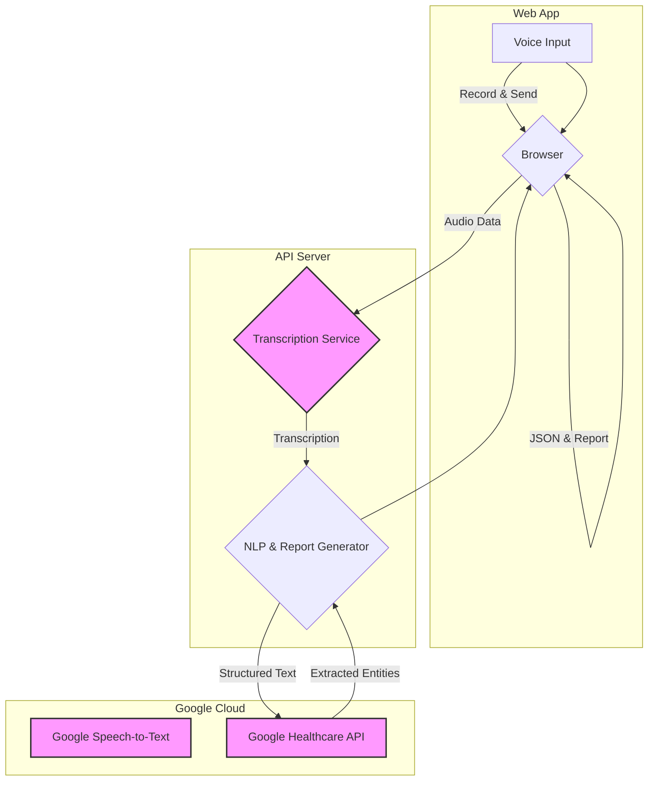
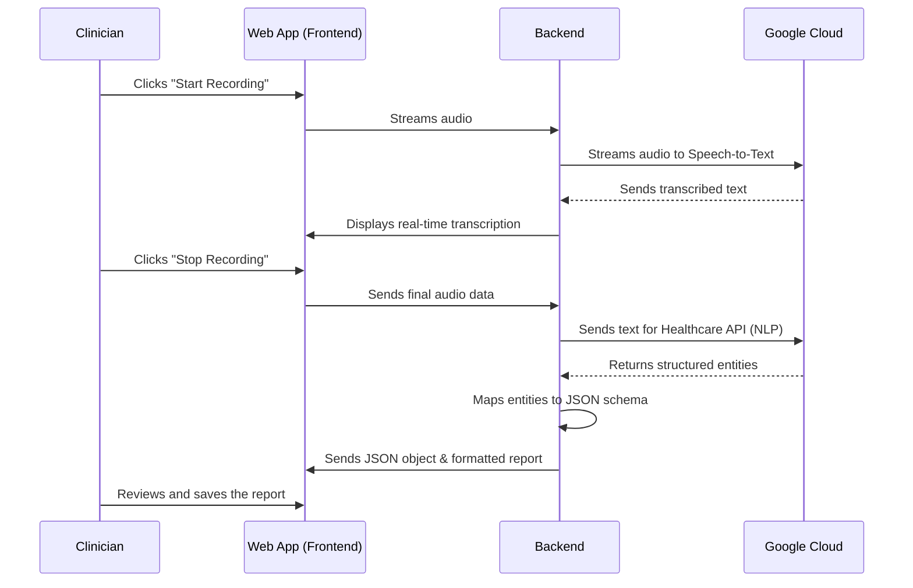

A project plan for a standalone speech-to-report generation application for pediatric oncology, without direct EMR integration, can be structured in an .md file with Mermaid graphs. The focus will be on converting spoken clinical notes into a structured JSON and a formatted discharge summary.

-----

### 1\. Project Scope & Objective

The objective is to develop a web application that takes voice input from a clinician and generates a structured discharge summary. The application will leverage Google Cloud's APIs to transcribe the speech, extract medical entities, and format the data into a JSON output and a readable summary. This phase will focus *only* on the report generation, with EMR integration planned for a later phase.

-----

### 2\. Proposed Architecture

The architecture will be a two-part system: a frontend web application and a backend API server.

**a. Frontend (Web Application)**:

- A single-page application (SPA) to provide the user interface.
- It will include a button to start and stop voice recording.
- Real-time display of transcribed text to allow the user to follow along.
- A preview of the generated JSON and the final discharge summary report.

**b. Backend (API Server)**:

- A middleware server (e.g., using Node.js, Python Flask) to handle API requests.
- This server will manage the communication between the frontend and Google Cloud APIs.
- It will receive audio data, send it for transcription, and then process the resulting text.

-----

### 3\. Implementation Plan & Features

The development will be broken down into the following key features and steps:

**a. Speech-to-Text Transcription**:

- The frontend will record audio and stream it to the backend.
- The backend will send this audio data to Google Cloud's Speech-to-Text API.
- The transcribed text will be sent back to the frontend for real-time display.

**b. Medical Entity Extraction & Analysis**:

- The backend will use Google Cloud Healthcare API's **`projects.locations.datasets.fhirStores.executeBundle`** to parse the transcribed clinical text. This API can be used to extract structured data from unstructured clinical notes.
- The model will be trained or configured to recognize oncology-specific terms, such as:
  - [cite\_start]**Diagnoses**: `B ALL HR/ Induction`[cite: 18].
  - [cite\_start]**Medical Professionals**: `Dr Prasanth.V.R`[cite: 17].
  - [cite\_start]**Clinical Findings**: `febrile (100.3 F)`, `Crepitations present`[cite: 19, 23].
  - [cite\_start]**Lab Results**: `Hb9`, `Wbc 1000`, `Platelet 147000`[cite: 25].
  - [cite\_start]**Medications**: `Cefoperazone sulbactam`, `Oseltamivir`[cite: 41, 42].
  - [cite\_start]**Patient Demographics**: `Age: 7`, `Sex: F`[cite: 6, 7].

**c. JSON & Report Generation**:

- The extracted entities will be mapped to the JSON schema defined in the previous plan.
- A final discharge summary will be generated as a readable, formatted text or PDF, based on the JSON data. The format will mimic the provided document, including sections for `Patient details`, `History`, `Clinical Examination`, `Investigations`, and `Treatment`.

I want following fileds to be incorporated , that is output schema should be like this example

{
  "department": "Department of Paediatric Oncology",
  "division_head": "Dr. Priyakumari T (Professor)",
  "service_head": "Dr. Priyakumari T (Professor)",
  "doctors": [
    "Dr. Manjusha Nair (Assoc. Professor)",
    "Dr. Prasanth VR (Asst. Professor)",
    "Dr. Binitha R (Assoc. Professor)",
    "Dr. Guruprasad CS (Assoc. Professor)",
    "Dr. Kalasekhar VS (Asst. Professor)"
  ],
  "patient_details": {
    "cr_no": "",
    "name": "",
    "age": "7",
    "sex": "F",
    "unit": "FC",
    "attending_oncologist": "Dr Prasanth.V.R."
  },
  "admission_details": {
    "diagnosis": "B ALL/FNP/LRTI",
    "histology": "NIL",
    "stage": "",
    "doa": "08-Jul-2025",
    "dod": "12-Jul-2025",
    "reason_for_admission": "Antibiotics and supportive care"
  },
  "history": {
    "chief_complaints": "fever associated with cough and rhinitis",
    "presenting_history": "B ALL HR/ Induction day 30 is now admitted with fever associated with cough and rhinitis."
  },
  "clinical_examination": {
    "general_condition": "Fair, febrile (100.3 F)",
    "vitals": {
      "hr": "120/min",
      "bp": "104/60mmhg"
    },
    "systems": {
      "respiratory_system": "No retractions. Crepitations present",
      "other_systems": "WNL"
    }
  },
  "investigations": {
    "lab_results": [
      {
        "date": "08/07/2025",
        "hb": "9",
        "wbc": "1000",
        "platelet": "147000",
        "dc_neutrophils": "23.6",
        "lymphocytes": "72.3",
        "eosinophils": "0.3",
        "monocytes": "2",
        "basophils": "1.8"
      },
      {
        "date": "08/07/2025",
        "hb": "6.7",
        "wbc": "700",
        "platelet": "88000",
        "dc_neutrophils": "43.3",
        "lymphocytes": "52.6",
        "eosinophils": "0.3",
        "monocytes": "3.8",
        "basophils": "0"
      },
      {
        "date": "08/07/2025",
        "total_protein": "6.51",
        "sodium": "138",
        "sgpt": "90",
        "sgot": "37",
        "potassium": "3.79",
        "urea": "24",
        "c_reactive_protein": "2.86",
        "phosphorus": "3.82",
        "creatinine": "0.27",
        "calcium": "8.28",
        "bilirubin_total": "0.65",
        "alkaline_phosphatase": "301",
        "albumin": "3.97",
        "random_sugar": "85",
        "potassium": "2.89",
        "phosphorus": "2.81",
        "creatinine": "0.23"
      },
      {
        "date": "09/07/2025",
        "hb": "10.4",
        "wbc": "600",
        "platelet": "135000",
        "dc_neutrophils": "89.2",
        "lymphocytes": "4.3",
        "eosinophils": "5.7",
        "monocytes": "0.8",
        "basophils": "0"
      },
      {
        "date": "10/07/2025",
        "hb": "7.4",
        "wbc": "800",
        "platelet": "179000",
        "dc_neutrophils": "26.3",
        "lymphocytes": "58",
        "eosinophils": "1.2",
        "monocytes": "14.5",
        "basophils": "0"
      },
      {
        "date": "10/07/2025",
        "urea": "16",
        "total_protein": "5.36",
        "sodium": "138",
        "potassium": "3.52",
        "phosphorus": "3.04",
        "magnesium": "1.85",
        "creatinine": "0.22",
        "calcium": "8.55",
        "c_reactive_protein": "3.82",
        "albumin": "3.28"
      },
      {
        "date": "12/07/2025",
        "hb": "11.5",
        "wbc": "1000",
        "platelet": "340000",
        "dc_neutrophils": "32.9",
        "lymphocytes": "56.2",
        "eosinophils": "0.9",
        "monocytes": "9.1",
        "basophils": "0.9"
      }
    ],
    "other_investigations": {
      "blood_culture": "sterile",
      "procalcitonin": "0.18",
      "cxr": "Normal"
    }
  },
  "treatment": {
    "drugs_regime_and_dose": {
      "d20_inj_vcr": "1.1. mg given on 11.7.2025",
      "d29_inj_dnr": "18 mg in 100ml NS over 1 hour"
    },
    "medications": [
      {
        "name": "IVF",
        "dose": ""
      },
      {
        "name": "Inj. Cefoperazone sulbactam",
        "dose": "x 3 days"
      },
      {
        "name": "Syp Oseltamivir",
        "dose": "for 3 days"
      },
      {
        "name": "Syp Clarithromycin",
        "dose": "x 3 days"
      },
      {
        "name": "Inj. Paracetamol",
        "dose": ""
      },
      {
        "name": "Nebulisation salbutamol",
        "dose": "Q6H"
      },
      {
        "name": "NSbs Budecort",
        "dose": "Q12H"
      },
      {
        "name": "Tab PDN 10 mg",
        "dose": "1/2-0-1/2"
      }
    ]
  },
  "course_in_hospital": "Child was admitted for the above complaints in the ward. She had mild respiratory distress for which she was started on oxygen via HFNC and IV fluids. Blood culture was done following which she was empirically initiated on Cefoperazone Sulbactam, Oseltamivir and Clarithromycin. Gradually her fever resolved. Oxygen was tapered and discontinued on day 2. Currently, she is afebrile for more than 48 hours. Her blood culture were sterile so far and her counts were in an increasing trend, hence she is being discharged with the following recommendations.",
  "emergency_contacts": {
    "casualty": "04712522458 (24 Hrs)",
    "a_clinic": "04712522317/2522392/2522391",
    "b_clinic": "04712522379/2522398",
    "c_clinic": "04712522202/2522371",
    "d_clinic": "04712522372/2522374",
    "e_clinic": "04712522334/2522397",
    "f_clinic": "04712522368/8289897454"
  }
}

-----

### 4\. Mermaid Graph Diagrams

#### A. Architecture Diagram

This diagram shows the flow of data for the standalone application, highlighting the interaction with Google Cloud without the EMR component.

#### B. Process Flow for Report Generation

This sequence diagram details the steps from user interaction to the final report output.

-----

### 5\. Next Steps

- **Develop the UI**: Create a minimalist interface that is easy for clinicians to use.
- **Backend APIs**: Build the backend endpoints for handling audio streams and processing text.
- **Testing**: Test the accuracy of the transcription and entity extraction, especially with medical jargon.
- **Final Report Generation**: Implement the final formatting logic to convert the JSON data into a clean, professional-looking discharge summary.

### 6\. Software Stack

python full stack - go with flask.
